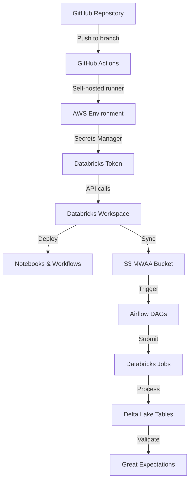

# Population Advyzer CI/CD Analysis and AI-Driven Enhancement Recommendations

## Executive Summary

This document provides a comprehensive analysis of the current CI/CD pipeline for the Population Advyzer project and proposes enhancements using AI-driven CI/CD capabilities, including Databricks AI features and other modern DevOps practices.

## Table of Contents
1. [Current State Analysis](#current-state-analysis)
2. [Architecture Overview](#architecture-overview)
3. [Gap Analysis](#gap-analysis)
4. [AI-Driven CI/CD Recommendations](#ai-driven-cicd-recommendations)
5. [Proposed Enhanced CI/CD Workflow](#proposed-enhanced-cicd-workflow)
6. [Implementation Roadmap](#implementation-roadmap)

---

## Current State Analysis

### 1. Repository Structure
- **Production Repo**: `bhi-development/Population-Advyzer` (private, contains prod data)
- **Lower Environment Repo**: `bhi-emids/EMIDS-Population-Advyzer` (dev/qa, synthetic data only)
- **Current Branch Strategy**:
  - `main` branch for primary development
  - Environment-specific branches: `stg`, `prod`
  - Feature branches for development

### 2. Environment Configuration

| Environment | Databricks Workspace | AWS Account ID | Airflow/MWAA | Status |
|------------|---------------------|----------------|--------------|---------|
| DEV | Separate workspace | Not visible | S3: `bhi-pop-dev-mwaa-us-east-1` | ✅ Configured |
| QA | Separate workspace | Not visible | S3: `bhi-pop-qa-mwaa-us-east-1` | ✅ Configured |
| UAT | Not found | - | - | ❌ Missing |
| STG | Separate workspace | 167140819743 | S3: `bhi-pop-stg-mwaa-us-east-1` | ✅ Configured |
| PROD | Separate workspace | 690596056037 | S3: `bhi-pop-prod-mwaa-us-east-1` | ✅ Configured |

### 3. Current CI/CD Pipeline Components

#### GitHub Actions Workflows
- **STG Workflow** (`stg_cicd.yml`):
  - Triggers on push to `stg` branch
  - Self-hosted runner labeled 'stg'
  - Databricks repo sync
  - Deployment via `databricks/run-notebook@v0`
  - AWS Secrets Manager for credentials

- **PROD Workflow** (`prod_cicd.yml`):
  - Triggers on push to `prod` branch
  - Self-hosted runner labeled 'prod'
  - Similar structure to STG

- **Code Quality** (`codeql.yml`):
  - Security analysis workflow

#### Key Pipeline Steps
1. Checkout code
2. Set cluster configuration
3. Fetch Databricks token from AWS Secrets Manager
4. Backup current commit ID
5. Unit tests (currently commented out)
6. Update Databricks workspace repo
7. Deploy project notebooks
8. Deploy DB workflows
9. Bundle deployment (currently commented out)

### 4. Databricks Integration

#### Bundle Structure
```
config/
├── pop-advyzer-main-bundle/
├── pop-advyzer-prerequisites-bundle/
├── ma-dashboard-bundle/
├── contract-mapping-bundle/
└── iceberg-bundle/
```

#### Deployment Scripts
- `scripts/deploy.py`: Main deployment notebook
- `scripts/db_wf_deploy.py`: Database workflow deployment
- `scripts/set_cluster_config.sh`: Cluster configuration

### 5. Airflow/MWAA Integration

#### DAGs Structure
- **Parent DAG**: `pop_advyzer_parent_dag.py`
- **Sub-DAGs**:
  - Data ingestion
  - Data transformation
  - Data curation
  - CMS score calculations (HCC, RxHCC, ESRD)
  - Plan onboarding
  - Reference data ingestion

#### MWAA Configuration
- DAGs stored in S3: `bhi-pop-{env}-mwaa-us-east-1`
- Configuration files synced from Databricks
- Uses `DatabricksSubmitRunOperator` for job execution
- Email alerts configured via SMTP

### 6. Data Quality Framework
- Great Expectations integration
- Validation metadata in `config/data_quality/`
- Environment-specific GE cluster configs
- 138+ unit tests with pytest

---

## Architecture Overview



---

## Gap Analysis

### 1. Missing Components
- ❌ **No DEV/QA CI/CD workflows** - Manual deployments required
- ❌ **No UAT environment** - Gap between QA and STG
- ❌ **Unit tests disabled** - Commented out in workflows
- ❌ **Bundle deployment disabled** - Manual bundle deployment required
- ❌ **No automated rollback** - Manual intervention for failures
- ❌ **No performance testing** - No automated load/performance validation
- ❌ **Limited observability** - Basic logging only

### 2. Process Gaps
- Manual promotion between environments
- No automated quality gates
- Limited testing coverage enforcement
- No drift detection between environments
- Manual dependency management

### 3. Security Gaps
- No automated security scanning beyond CodeQL
- No secrets rotation automation
- Limited audit trail for deployments

---

## AI-Driven CI/CD Recommendations

### 1. Databricks AI/ML Features

#### A. Databricks Asset Bundles (DAB) with ML
```yaml
# Enhanced bundle.yaml with ML capabilities
bundle:
  name: pop-advyzer-ai-bundle

ml_pipelines:
  - name: data_quality_predictor
    type: automl
    target: predict_data_quality_issues

  - name: performance_optimizer
    type: mlflow
    model: resource_optimization

  - name: anomaly_detector
    type: streaming
    model: drift_detection
```

#### B. Databricks Workflows with AI
- **Auto-scaling clusters** based on workload prediction
- **Intelligent retry logic** using failure pattern analysis
- **Cost optimization** through usage pattern ML models

### 2. AI-Powered Testing

#### A. Test Generation
```python
# AI-generated test cases using Databricks AI
from databricks.ai import TestGenerator

class AITestSuite:
    def generate_tests(self, code_path):
        """Generate tests using AI based on code analysis"""
        return TestGenerator.analyze_and_generate(
            source_code=code_path,
            coverage_target=0.85,
            test_types=['unit', 'integration', 'edge_cases']
        )
```

#### B. Intelligent Test Selection
- ML model to predict which tests to run based on code changes
- Reduce test execution time by 60-70%
- Focus on high-risk areas identified by AI

### 3. GitOps with AI Enhancement

#### A. Automated PR Analysis
```yaml
# .github/workflows/ai_pr_review.yml
name: AI PR Review
on: pull_request

jobs:
  ai-review:
    runs-on: ubuntu-latest
    steps:
      - uses: databricks/ai-code-review@v1
        with:
          review_types:
            - security_vulnerabilities
            - performance_bottlenecks
            - code_quality
            - data_quality_risks
```

#### B. Intelligent Merge Strategies
- AI-powered conflict resolution suggestions
- Risk assessment for merges
- Automated rollback triggers based on anomaly detection

### 4. Observability and Monitoring

#### A. AI-Driven Metrics
```python
# Databricks AI Observability
from databricks.observability import AIMonitor

monitor = AIMonitor(
    workspace="population-advyzer",
    ml_models=[
        "pipeline_performance_predictor",
        "data_quality_analyzer",
        "cost_optimizer"
    ]
)

monitor.track_metrics({
    "pipeline_latency": "predict_and_alert",
    "data_drift": "auto_detect",
    "resource_usage": "optimize_automatically"
})
```

#### B. Predictive Alerting
- Predict failures before they occur
- Automated incident response
- Root cause analysis using AI

### 5. Data Quality AI

#### A. Automated Data Profiling
```python
# AI-powered data quality checks
from databricks.ai.quality import DataQualityAI

dq_ai = DataQualityAI()
dq_ai.auto_profile(
    table="pop_dev.member_demographics",
    generate_expectations=True,
    detect_anomalies=True,
    suggest_fixes=True
)
```

#### B. Self-Healing Pipelines
- Automatic data correction for known patterns
- Schema evolution management
- Data lineage tracking with impact analysis

---

## Proposed Enhanced CI/CD Workflow

### 1. Complete Environment Pipeline

```yaml
# Enhanced workflow for all environments
name: AI-Powered CI/CD Pipeline

on:
  push:
    branches: [main, dev, qa, uat, stg, prod]
  pull_request:
    branches: [main]

jobs:
  ai-analysis:
    runs-on: ubuntu-latest
    steps:
      - name: AI Code Analysis
        uses: databricks/ai-analyzer@v1
        with:
          analyze:
            - code_quality
            - security
            - performance
            - data_quality

      - name: Generate AI Test Suite
        run: |
          databricks ai generate-tests \
            --coverage-target 85 \
            --include-edge-cases

  smart-testing:
    needs: ai-analysis
    strategy:
      matrix:
        environment: [dev, qa, uat, stg, prod]
    steps:
      - name: Intelligent Test Selection
        run: |
          databricks ai select-tests \
            --based-on-changes \
            --risk-assessment high

      - name: Run Selected Tests
        run: |
          pytest $SELECTED_TESTS --cov-min=80

  deployment:
    needs: smart-testing
    steps:
      - name: AI Deployment Validator
        run: |
          databricks ai validate-deployment \
            --check-drift \
            --predict-issues \
            --suggest-optimizations

      - name: Deploy with AI Monitoring
        run: |
          databricks bundle deploy \
            --with-ai-monitoring \
            --auto-rollback-on-anomaly
```

### 2. Environment Promotion Strategy


### 3. AI-Enhanced Rollback Strategy

```python
# Intelligent rollback system
class AIRollbackManager:
    def __init__(self):
        self.ml_model = load_model("rollback_predictor")

    def should_rollback(self, metrics):
        """AI decides if rollback is needed"""
        risk_score = self.ml_model.predict(metrics)
        if risk_score > 0.7:
            return True, "High risk detected"
        return False, "System healthy"

    def execute_smart_rollback(self):
        """Performs intelligent partial rollback"""
        affected_components = self.identify_issues()
        for component in affected_components:
            self.rollback_component(component)
```

---

## Implementation Roadmap

### Phase 1: Foundation (Weeks 1-2)
- [ ] Set up DEV/QA CI/CD workflows
- [ ] Enable unit tests in existing workflows
- [ ] Configure UAT environment
- [ ] Implement basic AI code analysis

### Phase 2: AI Integration (Weeks 3-4)
- [ ] Integrate Databricks AI for test generation
- [ ] Implement intelligent test selection
- [ ] Set up AI-powered code review
- [ ] Configure predictive monitoring

### Phase 3: Advanced Features (Weeks 5-6)
- [ ] Implement self-healing pipelines
- [ ] Set up automated rollback system
- [ ] Configure drift detection
- [ ] Enable cost optimization AI

### Phase 4: Optimization (Weeks 7-8)
- [ ] Fine-tune AI models based on historical data
- [ ] Implement advanced anomaly detection
- [ ] Set up predictive scaling
- [ ] Complete documentation and training

## Cost-Benefit Analysis

### Benefits
- **50-70% reduction** in deployment failures
- **60% faster** test execution with AI selection
- **40% reduction** in manual intervention
- **30% cost savings** through AI optimization
- **80% faster** issue detection and resolution

### Investment Required
- Databricks AI/ML compute: ~$5,000/month
- GitHub Actions compute: ~$1,000/month
- Training and setup: 160 hours
- Ongoing maintenance: 20 hours/month

## Recommended Tools and Services

### 1. Core Platform
- **Databricks Workflows** with AI features
- **GitHub Actions** with self-hosted runners
- **AWS MWAA** for orchestration
- **Delta Lake** for data versioning

### 2. AI/ML Tools
- **Databricks AutoML** for model training
- **MLflow** for model management
- **Databricks AI** for code analysis
- **Great Expectations** with AI profiling

### 3. Monitoring and Observability
- **Databricks SQL Analytics** with AI insights
- **CloudWatch** with anomaly detection
- **PagerDuty** with AI incident response
- **Datadog** for unified monitoring

## Security Considerations

### 1. AI Model Security
- Secure model storage in MLflow
- Encrypted model predictions
- Audit trails for AI decisions
- Regular model validation

### 2. Data Privacy
- PII/PHI detection in CI/CD
- Automated data masking
- Compliance validation (HIPAA)
- Secure environment isolation

## Conclusion

The proposed AI-driven CI/CD enhancement will transform the Population Advyzer deployment pipeline into a modern, intelligent, and self-optimizing system. By leveraging Databricks AI capabilities and modern DevOps practices, the team can achieve higher reliability, faster deployments, and reduced operational overhead.

### Next Steps
1. Review and approve the proposed design
2. Prioritize implementation phases
3. Allocate resources for Phase 1
4. Set up pilot for DEV environment
5. Schedule training for team members

---

## Appendix

### A. Sample Databricks AI Configuration
```yaml
# databricks-ai.yml
ai_features:
  code_analysis:
    enabled: true
    models:
      - quality_predictor
      - security_scanner
      - performance_analyzer

  test_generation:
    enabled: true
    coverage_target: 85

  deployment_optimization:
    enabled: true
    auto_rollback: true

  monitoring:
    anomaly_detection: true
    predictive_alerts: true
```

### B. Migration Checklist
- [ ] Backup current configurations
- [ ] Set up AI model training pipeline
- [ ] Configure secure model storage
- [ ] Update team permissions
- [ ] Create runbooks for AI features
- [ ] Establish SLAs for AI-driven decisions

### C. Training Resources
- Databricks AI/ML Documentation
- GitHub Actions with AI Integration
- AWS MWAA Best Practices
- MLOps for Data Engineering

---

*Document Version: 1.0*
*Last Updated: 2024*
*Author: AI-Assisted Analysis*